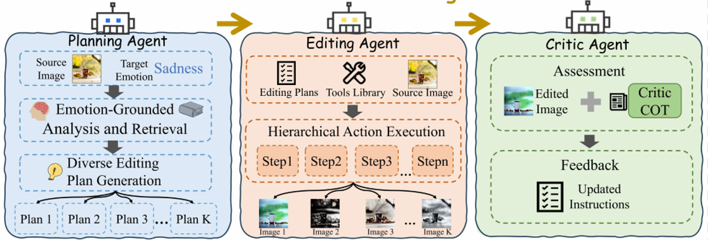
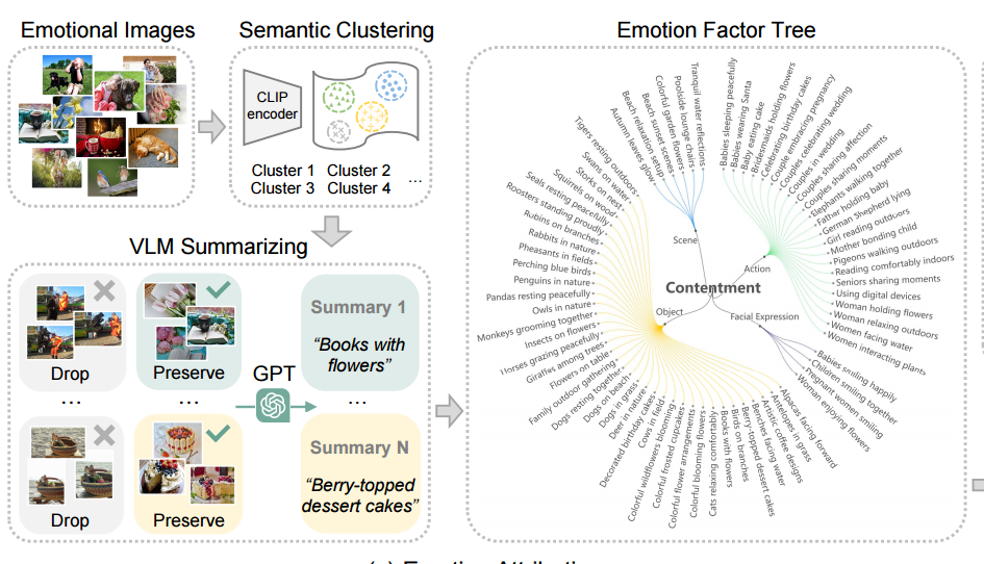
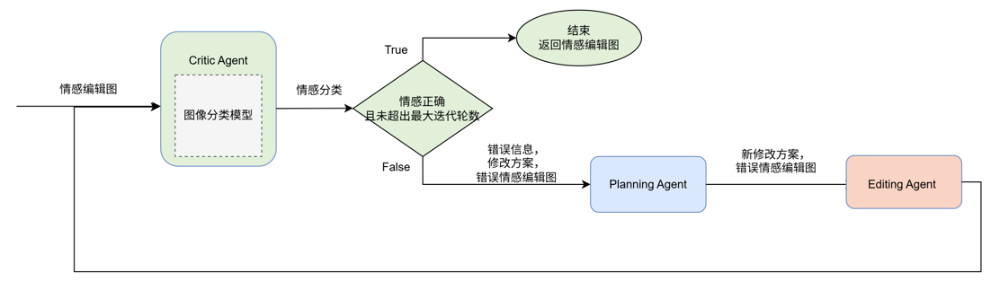
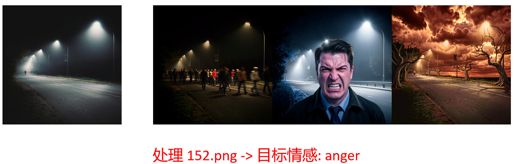

# 论文原型

《EmoAgent: A Multi-Agent Framework for Diverse Affective Image Manipulation》[IEEE, 2025]

解决D-AIM问题(Diverse Affection Image Manipulation)


利用三种Agent联合工作实现**EmoAgent**：

1.**Planning Agent:**Qwen2.5-VL-7B、情感知识数据库(CLIP特征提取+Kmeans聚类+Qwen提取修改建议)

2.**Editing Agent:**Flux.2-9B

3.**Critic Agent**:ResNet50










# 部署环境

AutoDL平台，Ubuntu22.04
GPU双卡RTX4090D，CUDA12.1
系统盘30GB，数据盘100GB
Conda运行环境：Python 3.10、PyTorch2.5.1


创建AutoDL租赁环境后完整配置流程：

```
cd /root/autodl-tmp

conda create -n ea python=3.10 -y
conda activate ea

pip install torch==2.5.1 torchvision==0.20.1 torchaudio==2.5.1 --index-url https://download.pytorch.org/whl/cu121

pip install pandas scikit-learn tqdm pillow

# 安装 Diffusers 及相关库 (用于运行 FLUX 模型)
pip install diffusers transformers accelerate

pip install torchao==0.8.0

# 安装辅助库
pip install openai Pillow

# 大模型下载库
pip install modelscope

# 验证关键包版本
python -c "import torch; print(torch.__version__, torch.version.cuda)"
```


# 文件结构

本项目部署到 `/root/autodl-tmp` 中。

```
/root/autodl-tmp
|- EmoEdit-inference		# EmoAgent最终测试数据集
|- EmoSet-118K			    # ResNet50和情感知识数据库 构建时使用的数据集
|- models				    # 存放大型模型
	|- black-forest-labs
		|- FLUX.2-klein-9B		# Flux.2模型(Editing Agent)
	|- clip
		|- vit-b-32				# Clip模型(用于构建情感知识数据库)
	|- Qwen						# Qwen模型(Planing Agent)
|- myEmoAgent				# *核心*：项目代码存放处
	|- emotion_knowledge_tree	# 存储情感知识数据库
	|- flux_edit_test			# 测试flux.2接口输出的文件夹
	|- output_flux				# *核心*：EmoAgent在EmoEdit-inference最终输出结果图、运行日志
	|- Qwen_test				# 测试Qwen接口输出的文件夹
	|- resnet50_train_process	# 存放ResNet50训练日志的地方
	|- single_test				# 存放一张用于Qwen测试的图片
	|- weights					# 训练后ResNet50参数存放地
	|- build_knowledge_base.py	# 构建情感知识数据库的脚本
	|- run_emoagent.py			# *核心*：EmoAgent实现与测试的脚本
	|- test_flux.py				# 测试flux.2接口输出的脚本
	|- test_Qwen.py				# 测试Qwen接口输出的脚本
	|- test_resnet50.py			# 测试训练后ResNet50情感分类效果的脚本
	|- train_resnet50.py		# 训练ResNet50情感分类的脚本
	|- README.md				# 项目文档
```


# 数据集、模型、实验结果的下载

由于本项目数据集、模型、实验结果比较多、比较大，因此在对应文件夹下会有`download.txt`文件指示出来数据集、模型、实验结果的下载位置。下面几个文件夹的数据集或模型或实验结果需要根据`download.txt`去进行下载：

```
/root/autodl-tmp/EmoEdit-inference

/root/autodl-tmp/EmoSet-118K

/root/autodl-tmp/models/black-forest-labs/FLUX.2-klein-9B

/root/autodl-tmp/models/clip/vit-b-32

/root/autodl-tmp/models/Qwen

/root/autodl-tmp/myEmoAgent/output_flux

/root/autodl-tmp/myEmoAgent/weights
```


# 实验结果

在`EmoEdit-inference`的405张图上，模拟用户随机赋予图像情感对EmoAgent进行测试，测试结果如下：

**定量分析**

Emo-A=68%，Emo-S=0.3849

**定性分析**





**ppt讲解原理与实验**：`./ppt/EmoAgent论文研究与复现.pptx`，在`./ppt`中的download.txt中的网盘中下载

